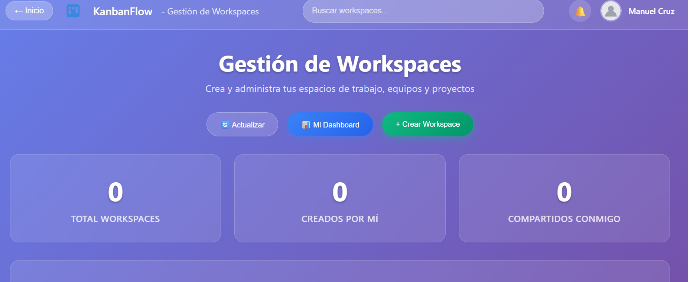
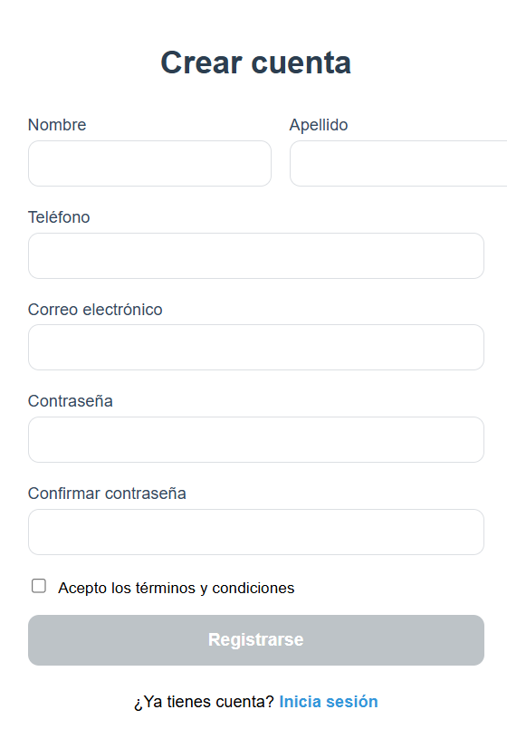
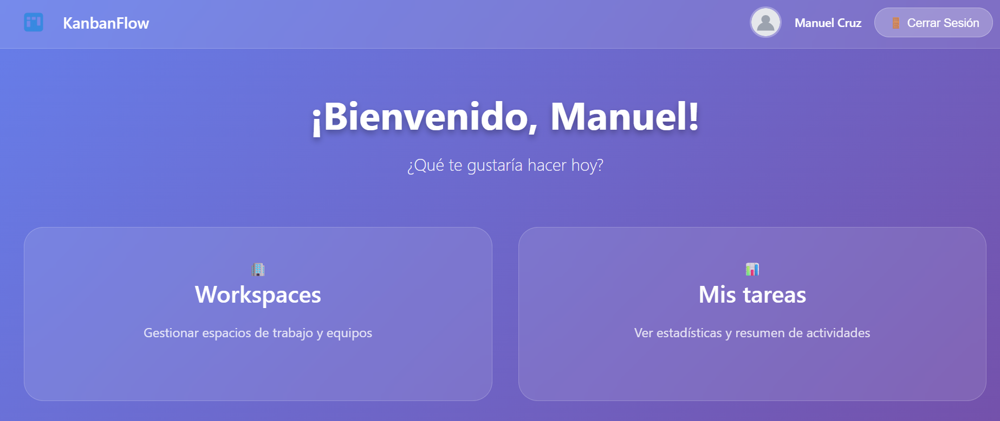
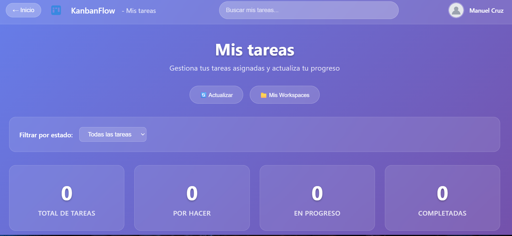

# Sistema KanbanFlow - Gestión de Tareas y Equipos

Una aplicación web completa de gestión de proyectos colaborativos con frontend Angular 17+ y backend Laravel, permitiendo la administración de workspaces, equipos y tareas con diferentes niveles de permisos.

---

## Descripción del proyecto

Este sistema Kanban tiene como objetivo crear una plataforma completa de gestión de proyectos colaborativos, donde los usuarios pueden crear espacios de trabajo, formar equipos y asignar tareas con diferentes niveles de permisos.

### Funcionalidades principales

- **Autenticación**  
  Sistema completo de registro, login y gestión de tokens con Laravel Sanctum y Angular JWT.

- **Dashboard Personal**  
  Panel individual para visualizar y gestionar tareas asignadas al usuario.

- **Workspaces**  
  Espacios de trabajo que funcionan como contenedores principales para organizar proyectos.

- **Teams**  
  Equipos de trabajo dentro de los workspaces con roles diferenciados (líder/miembro).

- **Pizarra Kanban**  
  Tablero visual para gestión de tareas con columnas de estado.

- **Tasks**  
  Sistema de tareas asignables con seguimiento de progreso y estados.

- **Permisos**  
  Control granular de permisos basado en roles de usuario.

---

### Tecnologías utilizadas

#### Frontend (Angular)
- **Angular 20+** con arquitectura standalone
- **TypeScript**
- **SCSS** con diseño glassmorphism
- **JWT** para autenticación
- **Responsive Design**

#### Backend (Laravel)
- **Laravel 12.x**  
- **PHP 8.2+**
- **Laravel Sanctum** para autenticación API
- **MySQL/PostgreSQL** para base de datos
- **Eloquent ORM** para manejo de datos

---

## 📸 Capturas de Pantalla

Explora las principales funcionalidades del sistema a través de estas capturas de pantalla:

### **Gestión de Workspaces**

*Vista principal de gestión de espacios de trabajo, donde los usuarios pueden crear, administrar y acceder a sus proyectos. Incluye estadísticas y navegación intuitiva.*

###  **Registro de Usuario**

*Formulario de registro con validaciones en tiempo real, diseño glassmorphism y campos obligatorios para crear una cuenta nueva en el sistema.*

###  **Pizarra Kanban**

*Tablero visual estilo Kanban para gestión de tareas por equipos, con columnas de estado (Pendiente, En Progreso, Completado) y funcionalidad drag & drop.*

###  **Dashboard de Tareas**

*Panel personal del usuario mostrando estadísticas de tareas asignadas, progreso individual y filtros por estado para una gestión eficiente.*

---

## Arquitectura del Sistema Angular

### Componentes Principales

#### 1. **DashboardComponent** 
- **Propósito**: Panel personal para gestión individual de tareas
- **Ubicación**: `src/app/auth/dashboard/`
- **Funcionalidades**:
  - Visualización de estadísticas personales
  - Filtrado de tareas por estado
  - Actualización de progreso de tareas
  - Vista de información del equipo


```typescript
// Métodos principales
getUserTasks(): void           // Obtiene tareas del usuario
updateTaskProgress(task): void // Actualiza progreso de tareas
getFilteredTasks(): any[]      // Filtra tareas por estado
getCompletedTasks(): any[]     // Tareas completadas
getPendingTasks(): any[]       // Tareas pendientes
```

#### 2. **HomeSelectorComponent**
- **Propósito**: Navegación hub para elegir entre dashboard o workspace
- **Ubicación**: `src/app/auth/home-selector/`
- **Funcionalidades**:
  - Selección entre gestión personal y administrativa
  - Interfaz elegante con diseño de tarjetas
  - Información del usuario autenticado
```typescript
// Métodos principales
goToDashboard(): void    // Navegar al dashboard personal
goToWorkspaces(): void   // Navegar a gestión de workspaces
```

#### 3. **WorkspaceListComponent**
- **Propósito**: Gestión completa de espacios de trabajo
- **Ubicación**: `src/app/auth/workspace-list/`
- **Funcionalidades**:
  - Creación y eliminación de workspaces
  - Estadísticas de workspaces (creados, compartidos)
  - Navegación a equipos y gestión
```typescript
// Métodos principales
createWorkspace(): void           // Crear nuevo workspace
deleteWorkspace(id): void         // Eliminar workspace
getCreatedByMeCount(): number     // Contar workspaces creados
getSharedWithMeCount(): number    // Contar workspaces compartidos
refresh(): void                   // Actualizar datos
```

#### 4. **PizarraComponent (Kanban Board)**
- **Propósito**: Tablero Kanban visual para gestión de tareas
- **Ubicación**: `src/app/auth/pizarra/`
- **Funcionalidades**:
  - Vista de columnas por estado (Pendiente, En Progreso, Completado)
  - Drag & drop para cambio de estado
  - Gestión de miembros del equipo
  - Creación y edición de tareas
```typescript
// Métodos principales
loadTasks(): void              // Cargar tareas del equipo
addTeamMember(): void          // Agregar miembro al equipo
createTask(): void             // Crear nueva tarea
editTask(task): void           // Editar tarea existente
updateTaskStatus(task): void   // Actualizar estado de tarea
```

#### 5. **TeamListComponent**
- **Propósito**: Gestión de equipos de trabajo
- **Ubicación**: `src/app/auth/team-list/`
- **Funcionalidades**:
  - Lista de equipos del usuario
  - Navegación a pizarra Kanban
  - Gestión de membresías
```typescript
// Métodos principales
loadTeams(): void          // Cargar equipos del usuario
goToPizarra(teamId): void  // Navegar a pizarra del equipo
```

#### 6. **TaskListComponent**
- **Propósito**: Lista de tareas específicas por equipo
- **Ubicación**: `src/app/auth/task-list/`
- **Funcionalidades**:
  - Filtrado de tareas por equipo
  - Navegación a detalles de tarea
```typescript
// Métodos principales
ngOnInit(): void        // Cargar y filtrar tareas
goToTask(taskId): void  // Navegar a detalle de tarea
```

### Componentes de Autenticación

#### 7. **LoginComponent**
- **Propósito**: Pantalla de inicio de sesión de usuarios
- **Ubicación**: `src/app/auth/login/`
- **Funcionalidades**:
  - Formulario reactivo con validaciones
  - Autenticación vía AuthService
  - Redirección automática al home selector
  - Validación de email y contraseña
```typescript
// Métodos principales
ngOnInit(): void          // Inicializar formulario reactivo
onSubmit(): void          // Procesar inicio de sesión
get email()              // Getter para validación de email
get password()           // Getter para validación de contraseña

// Validaciones
- Email: required, formato email válido
- Password: required, mínimo 8 caracteres
```

#### 8. **RegisterComponent**
- **Propósito**: Pantalla de registro de nuevos usuarios
- **Ubicación**: `src/app/auth/register/`
- **Funcionalidades**:
  - Formulario de registro completo
  - Validación de confirmación de contraseña
  - Términos y condiciones
  - Integración con backend Laravel
```typescript
// Métodos principales
onRegister(): void        // Procesar registro de usuario

// Modelo de datos
form = {
  first_name: string     // Nombre (requerido)
  last_name: string      // Apellido (requerido)
  phone: string          // Teléfono (opcional)
  email: string          // Email (requerido, único)
  password: string       // Contraseña (requerido, min 8)
  confirmPassword: string // Confirmación de contraseña
  acceptTerms: boolean   // Aceptación de términos
}

// Validaciones
- Campos obligatorios: first_name, last_name, email, password
- Coincidencia de contraseñas
- Aceptación de términos y condiciones
- Formato de email válido
```

#### 9. **ForgotPasswordComponent**
- **Propósito**: Solicitud de recuperación de contraseña
- **Ubicación**: `src/app/auth/forgot-password/`
- **Funcionalidades**:
  - Formulario para solicitar recuperación
  - Envío de email de recuperación
  - Mensajes de confirmación y error
  - Redirección automática a login
```typescript
// Métodos principales
onSubmit(): void          // Enviar solicitud de recuperación
goToLogin(): void         // Navegar a pantalla de login
get email()              // Getter para validación de email

// Estados del componente
loading: boolean         // Estado de carga
message: string         // Mensaje de confirmación
error: string           // Mensaje de error
```

#### 10. **ResetPasswordComponent**
- **Propósito**: Restablecer contraseña con token de recuperación
- **Ubicación**: `src/app/auth/reset-password/`
- **Funcionalidades**:
  - Formulario de nueva contraseña
  - Validación de token de recuperación
  - Confirmación de contraseña
  - Validador personalizado de coincidencia
```typescript
// Métodos principales
ngOnInit(): void                    // Obtener token y email de URL
onSubmit(): void                   // Procesar cambio de contraseña
passwordMatchValidator(): any      // Validador personalizado
get password()                     // Getter para contraseña
get passwordConfirmation()         // Getter para confirmación

// Parámetros de URL
token: string           // Token de recuperación
email: string          // Email del usuario

// Validaciones
- Password: required, mínimo 8 caracteres
- Password confirmation: required, debe coincidir
- Token y email válidos desde URL
```

### Servicios (Services)

#### 1. **AuthService**
- **Ubicación**: `src/app/services/auth.ts`
- **Propósito**: Gestión de autenticación y autorización
```typescript
// Métodos principales
login(credentials): Observable<any>     // Iniciar sesión
register(userData): Observable<any>     // Registro de usuario
logout(): void                          // Cerrar sesión
getToken(): string                      // Obtener token JWT
isAuthenticated(): boolean              // Verificar autenticación
getCurrentUser(): any                   // Usuario actual
```

#### 2. **WorkspaceService**
- **Ubicación**: `src/app/services/workspace.ts`
- **Propósito**: Gestión de espacios de trabajo
```typescript
// Métodos principales
getWorkspaces(): Observable<any[]>      // Listar workspaces
createWorkspace(data): Observable<any>  // Crear workspace
updateWorkspace(id, data): Observable<any> // Actualizar workspace
deleteWorkspace(id): Observable<any>    // Eliminar workspace
getWorkspaceById(id): Observable<any>   // Obtener workspace específico
```

#### 3. **TeamService**
- **Ubicación**: `src/app/services/team.ts`
- **Propósito**: Gestión de equipos de trabajo
```typescript
// Métodos principales
getTeams(): Observable<any[]>           // Listar equipos del usuario
createTeam(data): Observable<any>       // Crear equipo
getTeamMembers(teamId): Observable<any[]> // Obtener miembros
addMember(teamId, userData): Observable<any> // Agregar miembro
removeMember(teamId, userId): Observable<any> // Quitar miembro
getTeamTasks(teamId): Observable<any[]> // Tareas del equipo
```

#### 4. **TaskService**
- **Ubicación**: `src/app/services/task.ts`
- **Propósito**: Gestión de tareas
```typescript
// Métodos principales
getTasks(): Observable<any[]>           // Tareas del usuario
createTask(taskData): Observable<any>   // Crear tarea
updateTask(id, data): Observable<any>   // Actualizar tarea
deleteTask(id): Observable<any>         // Eliminar tarea
updateTaskProgress(id, progress): Observable<any> // Actualizar progreso
```

#### 5. **UserService**
- **Ubicación**: `src/app/services/user.service.ts`
- **Propósito**: Gestión de usuarios
```typescript
// Métodos principales
getAllUsers(): Observable<any[]>        // Listar todos los usuarios
getUserById(id): Observable<any>        // Obtener usuario específico
updateUser(id, data): Observable<any>   // Actualizar información de usuario
```

### Guards (Protección de Rutas)

#### 1. **AuthGuard**
- **Ubicación**: `src/app/guards/auth.guard.ts`
- **Propósito**: Proteger rutas que requieren autenticación
```typescript
canActivate(): boolean {
  // Verificar si el usuario está autenticado
  // Redirigir a login si no está autenticado
}
```

#### 2. **PublicGuard**
- **Ubicación**: `src/app/guards/public.guard.ts`
- **Propósito**: Proteger rutas públicas (login, register)
```typescript
canActivate(): boolean {
  // Redirigir a dashboard si ya está autenticado
  // Permitir acceso si no está autenticado
}
```

### Interceptors

#### 1. **TokenInterceptor**
- **Ubicación**: `src/app/interceptors/token.interceptor.ts`
- **Propósito**: Agregar automáticamente el token JWT a las peticiones HTTP
```typescript
intercept(req: HttpRequest<any>, next: HttpHandler): Observable<HttpEvent<any>> {
  // Agregar Authorization header con Bearer token
  // Manejar errores de autenticación
}
```

---

##  Sistema de Diseño

### Glassmorphism Design System
- **Colores primarios**: Gradientes azules y morados
- **Backdrop filters**: Efecto cristal en tarjetas
- **Sombras**: Box-shadow suaves
- **Transparencias**: Backgrounds semi-transparentes
- **Animaciones**: Transiciones suaves en hover

### Estructura SCSS
```scss
// Variables principales
$primary-gradient: linear-gradient(135deg, #667eea 0%, #764ba2 100%);
$glass-background: rgba(255, 255, 255, 0.1);
$backdrop-filter: blur(10px);
$border-radius: 15px;
$box-shadow: 0 8px 32px 0 rgba(31, 38, 135, 0.37);
```

---


```

---

##  API de Gestión de Tareas y Equipos - Laravel

### Guía de Uso Rápido

### **1. AUTENTICACIÓN (OBLIGATORIO)**

```bash
# Registro de usuario
POST /api/register
{
  "first_name": "Juan",
  "last_name": "Pérez", 
  "email": "juan@email.com",
  "password": "123456",
  "password_confirmation": "123456"
}

# Login para obtener token
POST /api/login
{
  "email": "juan@email.com",
  "password": "123456"
}
# Respuesta: { "user": {...}, "token": "TOKEN_AQUÍ" }

# Usar token en TODAS las peticiones siguientes:
Headers: {
  "Authorization": "Bearer TOKEN_AQUÍ",
  "Content-Type": "application/json"
}
```

### **2. FLUJO DE TRABAJO (ORDEN OBLIGATORIO)**

```bash
# PASO 1: Crear workspace (PRIMERO)
POST /api/workspaces
{ 
  "name": "Mi Proyecto", 
  "description": "Descripción del proyecto" 
}
# Respuesta: { "success": true }

# PASO 2: Crear equipo (SEGUNDO)  
POST /api/teams
{ 
  "name": "Frontend Team", 
  "workspace_id": 1 
}
# Respuesta: { "success": true }

# PASO 3: Agregar miembros (TERCERO)
POST /api/teams/1/add-member
{ 
  "user_id": 2, 
  "role": "member" 
}
# Respuesta: { "success": true }

# PASO 4: Crear tareas (CUARTO)
POST /api/tasks
{ 
  "title": "Implementar login",
  "description": "Crear pantalla de autenticación",
  "workspace_id": 1,
  "team_id": 1, 
  "assigned_to": 2
}
# Respuesta: { "success": true }

# PASO 5: Actualizar progreso (QUINTO)
PUT /api/tasks/1
{ 
  "progress": 50, 
  "is_done": false 
}
# Respuesta: { "success": true }
```

###  **3. ROLES Y PERMISOS**

**CREADOR DE WORKSPACE:**
- ✅ Puede crear/editar/eliminar workspace
- ✅ Puede crear equipos dentro del workspace
- ✅ Ve todas las tareas del workspace
- ❌ No puede gestionar miembros de equipos

**LÍDER DE EQUIPO:**
- ✅ Puede agregar/quitar miembros del equipo
- ✅ Puede crear/editar/eliminar tareas
- ✅ Puede cambiar TODO en las tareas (título, descripción, asignación)
- ✅ Ve todas las tareas del equipo

**MIEMBRO DE EQUIPO:**
- ✅ Ve solo sus tareas asignadas
- ✅ Puede actualizar progress e is_done de sus tareas
- ❌ NO puede crear/eliminar tareas
- ❌ NO puede gestionar miembros

###  **4. CONSULTAS IMPORTANTES**

```bash
# Ver mis tareas asignadas
GET /api/tasks

# Ver mis equipos donde participo
GET /api/teams

# Ver miembros de un equipo
GET /api/teams/1/members

# Ver tareas de un equipo
GET /api/teams/1/tasks

# Ver todos los usuarios (para asignar tareas)
GET /api/users

# Ver tareas de un workspace
GET /api/workspaces/1/tasks
```

### **5. RESPUESTAS DE LA API**

```json
// ÉXITO en operaciones (crear, editar, eliminar)
{ "success": true }

// ERROR en cualquier operación
{ 
  "success": false, 
  "error": "Mensaje descriptivo del error" 
}

// DATOS en consultas GET
[
  { 
    "id": 1, 
    "name": "Nombre del recurso",
    "..." 
  }
]
```

---
